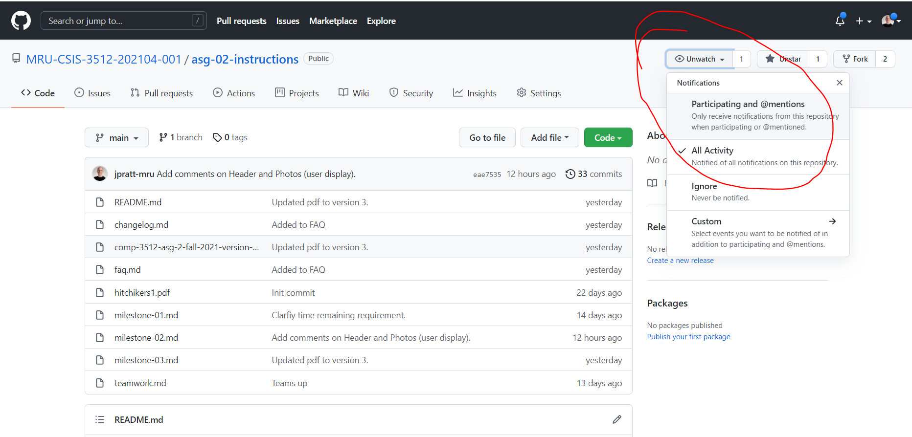

# Assignment 02 - Milestone 03

**Due December 8 (W) @ 9 PM**

**Worth 15% of your final grade**

_Holy cow - I think we're gonna make it!_

## About These Instructions

This is a complex assignment with a lot of moving parts. Despite my best efforts, there will likely be things that don't make sense or need further clarification! Ask questions and I'll make decisions and alter this document and update the FAQ.

If you watch the instructions repo through the watch menu on GitHub (shown below), you'll get notified when I make changes by email:

## Your Mark

I have separated requirements into the following sections (the ⚠ denotes either a new requirement or a requirement that has changed significantly since milestone 2). _Other minor changes from milestone 2 are likely present as well, so I think reading through all of these to be safe is a good idea._

1. [Non-Perkable Requirements](#non-perkable-requirements) ⚠
2. [Visual Design Requirements](#the-visual-design-requirements) ⚠
3. [Validation Requirements](#validation-requirements)
4. [Header Requirements](#the-header-requirements) ⚠
5. [Home Requirements](#the-home-page-requirements) ⚠
6. [Country Page Requirements](#the-country-page-requirements)
7. [City Page Requirements](#the-city-page-requirements)
8. [Photo Page Requirements](#the-photo-page-requirements) ⚠
9. [Favorites Page Requirements](#the-favorites-page-requirements) ⚠
10. [About Page Requirements](#the-about-page-requirements) ⚠
11. [Browse/Search Page Requirements](#the-browsesearch-page-requirements) ⚠
12. [Login Page Requirements](#the-login-page-requirements) ⚠
13. [Registration/Signup Page Requirements](#the-registrationsignup-page-requirements) ⚠
14. [Country List/Filter Requirements](#the-country-listfilter-requirements)
15. [Logout Requirements](#the-logout-requirements) ⚠
16. [Countries API Requirements](#the-countries-api-requirements)
17. [Best Practice Requirements](#the-best-practice-requirements) ⚠

For a section to be considered "completed", **ALL** requirements in that section must be completed.

| completed requirement sections                                              | mark | range  |
| --------------------------------------------------------------------------- | ---- | ------ |
| Non-Perkable **&** Header **&** Validation **&** API **&** About            | F+   | 25-49  |
| F+ req's **&** Country List/FIlter **&** Country, City, and Photo Pages     | D+   | 55-59  |
| D+ req's **&** Home (logged in **&** out versions) **&** Login **&** Logout | C    | 63-66  |
| C req's **&** Visual Design **&** Registration                              | B    | 73-76  |
| B req's **&** Best Practices **&** **one** of Favorites, Browse/Search      | A    | 85-94  |
| All req's                                                                   | A+   | 95-100 |

## Non-Perkable Requirements

These requirements **cannot** be postponed through the use of Perks:

- [ ] The site is hosted through Heroku and connected to your GitHub Classroom Assignment.

- [ ] **All** image files are hosted on Cloudinary.

- [ ] The `README.txt` file contains the names of all team members and the Heroku URL of the site you wish me to mark.

- [ ] The URL provided in the README goes to the Home page.

- [ ] You only cache country data - and you pull it in from your own API.

- [ ] You only populate the Country List (and possible Country Details) using JS; all other data that **can** be pulled in from the database **is** pulled in from the database and presented via PHP.

- [ ] All data used on the site must come from a mySQL database populated through the script `travel-3rd.sql`.

  > _further information on the database is provided in the [Database Details](database-details.md) document_

- [ ] All DB access is via PDO. No mysqli is used.

- [ ] Prepared statements must be used for any database query that involves query string data.

- [ ] No `alert()s` are used on the site.

  > _seriously...I HATE those things!_

## Perkable Requirements

These requirements **can** be postponed through use of Perks.

The cost for getting extensions depends on the the number of extensions being requested and the number of group members:

| # extensions | 2-memb cost | 3-memb cost | 4-memb cost | 5-memb cost |
| ------------ | ----------- | ----------- | ----------- | ----------- |
| 1            | 1           | 1           | 1           | 1           |
| 2            | 2           | 2           | 3           | 4           |
| 3            | 4           | 4           | 6           | 8           |
| 4            | 6           | 7           | 10          | 12          |
| 5            | 8           | 11          | 15          | 18          |
| 6            | 11          | 16          | 21          | 24          |
| 7            | 14          | 22          | 28          | 34          |

If you ask for extensions, I will now need to know **who** is paying **how many** Perks!

> _Say you're in a group with 3 members._
>
> _Member A has 2 Perks, Member B has 4, and Member C has 4. They have 2 + 4 + 4 = 10 Perks to spend on extensions._
>
> _If they decide they need 4 extensions, they'd have to pay 7 Perks and let me know who is paying what. (Like, "A will pay 1 and B and C will pay 3 each.")_

---

### The Visual Design Requirements

- [ ] The visual design is portfolio-level quality. I'll be looking for generous use of whitespace, alignment of items, contrast of text in size and weight, good use of color (including accents), non-distorted images, etc.

> _I get that people are uber-busy on the back-end, coding up the codez. But you really **do** have to expend at least a *bit* of effort making things look presentable._
>
> _If you want to use a framework of some kind to help with this, that's fine. I'm not asking for too much...but it shouldn't look like minimal effort was applied and that visual design was an afterthought. This project is supposed to be something you can proudly put in your portfolio - and should look accordingly professional._
>
> _I'll pop my head onto your sites from time to time to provide suggestions for improvement - that way, you'll have time to adjust things before the deadline._

---

### The Validation Requirements

_Since I don't want to check **every** page for valid HTML and CSS, I will instead let the Goddess of Fate decide: I will **randomly** choose ONE page to check for HTML violations and ONE page to check for CSS violations._

_**If I go to a valid URL and the page is not present, that will count as an unmet requirement!**_

- [ ] All CSS on a randomly chosen page is declared valid by the [W3C CSS Validation Service](https://jigsaw.w3.org/css-validator/).

- [ ] All HTML on a randomly chosen page is declared valid by the [W3C Markup Validation Service](https://validator.w3.org/).

---

### The Header Requirements

- [ ] The Header has a logo appropriate for the site.

  > _this is a **travel photo** site..._

- [ ] The Header has a navigation menu.

- [ ] The navigation menu is a "hamburger" menu at mobile L size.

- [ ] The navigation menu is a "standard" menu at Laptop L size.

##### ⚠ a significant new Header requirement

- [ ] The navigation menu contains working links to the following pages:

  - Home (when not logged in)
  - Home (when logged in) *aka* Profile
  - About
  - Browse/Search
  - Countries
  - Favorites (only if logged in, otherwise not present)
  - Login/Logout (visibility appropriate to whether user is logged in or out)
  - Registration/Sign Up (only if not logged in, otherwise not present)

---

### The Home Page Requirements

#### not logged in version

_An overview of the Home Page (not logged in version) can be found on page 3 of the [assignment pdf](comp-3512-asg-2-fall-2021-version-4.pdf)._

All requirements from milestone 1 are in effect.

##### ⚠ significant new Home Page (not logged in) requirements

- [ ] The ability to log in and sign up are now functioning.

  > _see the [Login](#the-login-page-requirements) and [Registration](#the-registration-page-requirements) Pages for further details_

- [ ] The search box is now functioning - using it takes the user to the [Browse/Search Page](#the-browsesearch-page-requirements) and displays results as if they had performed a title search on that page.

#### logged in version (aka the Profile Page)

_An overview of the Home Page (not logged in version) can be found on page 4 of the [assignment pdf](comp-3512-asg-2-fall-2021-version-4.pdf)._

- [ ] The logged-in user's first name, last name, city, and country are nicely displayed.

- [ ] Any photos that belong to a user are clearly visible and nicely displayed here.

  > _In previous versions of this assignment, users were able to upload photos. Even though this is not a requirement for this year, there are still users in the Users table that have photos belonging to them. Make sure you check your work for this requirement by logging in as one of those users!_

- [ ] If the user has any favorited photos, they are clearly visible and nicely displayed here.

  > _favorited photos are described initially in the [Photos Page](#the-photo-page-requirements)_

- [ ] If the user has no favorited photos, that is nicely indicated.

- [ ] 10 to 12 recommended photos are clearly visible and nicely displayed here. For more information on the recommendation process, see page 4 of the assignment pdf.

- [ ] Each photo present hyperlinks to the `single-photo.php` page with an appropriate query string parameter.

---

### The Country Page Requirements

_An overview of the Country Page can be found on page 5 of the [assignment pdf](comp-3512-asg-2-fall-2021-version-4.pdf)._

- [ ] The file for this page is named **single-country.php**.

- [ ] If the query string parameter for this page is invalid in any way, the user is redirected to a generic error page. A non-existent query string is **not** invalid!

- [ ] This page has a Header, as detailed in the [Header requirements](#the-header-requirements).

- [ ] When viewed in Chrome's devtools at Mobile L size (425px) and Laptop L size (1440px), this page has a reasonable layout.

- [ ] All country details, as outlined in the assignment pdf, are present for the current country. _Since you've cached the country details, you can present them via JS if you wish._ Country details must include the extra language and neighbouring country requirements that were present in assignment 1: full names must be used instead of codes.

  > _if the query string parameter is non-existent, this country details section should show no data_

- [ ] If photos are available for the current country, they are displayed in a well-presented fashion.

  > _The sizes can be changed from the restrictions presented in assignment 1, but all images **must** be hosted on Cloudinary and **must** be resized so that the user isn't pulling down unnecessarily large image files!_

- [ ] If photos are **not** available for the current country, that fact is indicated in a clear and well-presented way.

  > _if the query string parameter is non-existent, this photos section should show no data_

- [ ] Each photo present hyperlinks to the `single-photo.php` page with an appropriate query string parameter.

---

### The City Page Requirements

_An overview of the City Page can be found on page 6 of the [assignment pdf](comp-3512-asg-2-fall-2021-version-4.pdf)._

- [ ] The file for this page is named **single-city.php**.

- [ ] If the query string parameter for this page is invalid in any way, the user is redirected to a generic error page. **A non-existent query string is invalid!**

- [ ] This page has a Header, as detailed in the [Header section](#the-header-requirements).

- [ ] When viewed in Chrome's devtools at Mobile L size (425px) and Laptop L size (1440px), this page has a reasonable layout.

- [ ] All city details, as outlined in the [assignment pdf](comp-3512-asg-2-fall-2021-version-4.pdf), are present for the current city. All details are generated via PHP.

- [ ] The static country map described in the assignment pdf is present for the current city.

  > _Yes - a map using the [Google Maps Static API](https://developers.google.com/maps/documentation/maps-static/overview). You've got plenty of time to get your credits in order now and read up on this API._

- [ ] If photos are available for the current city, they are displayed in a well-presented fashion.

  > _The sizes can be changed from the restrictions presented in assignment 1, but all images **must** be hosted on Cloudinary and **must** be resized so that the user isn't pulling down unnecessarily large image files!_

- [ ] If photos are **not** available for the current city, that fact is indicated in a clear and well-presented way.

- [ ] Each photo hyperlinks to the `single-photo.php` page with an appropriate query string parameter.

---

### The Photo Page Requirements

_An overview of the Photo Page can be found on page 7 of the [assignment pdf](comp-3512-asg-2-fall-2021-version-4.pdf)._

- [ ] The file for this page is named **single-photo.php**.

- [ ] If the query string parameter for this page is invalid in any way, the user is redirected to a generic error page. **A non-existent query string is invalid.**

- [ ] This page has a Header, as detailed in the [Header section](#the-header-requirements).

- [ ] When viewed in Chrome's devtools at Mobile L size (425px) and Laptop L size (1440px), this page has a reasonable layout.

- [ ] A larger version of the thumbnail that caused this view to appear is displayed. You can choose a size that works for your layout.

  > _A Cloudinary transformation must be used to achieve this - you cannot just use CSS to shoehorn an improperly-sized image onto the page._

- [ ] In addition to the photo itself, the title, user name (not optional this time!), city, and country are also displayed. All details are generated via PHP.

  > _**comment from JP**: there is a `UserID` field in the `imagedetails` database table to help you with getting the proper user_

- [ ] The city name shown on the page hyperlinks to the `single-city.php` page with an appropriate query string parameter.

- [ ] The country name shown on the page hyperlinks to the `single-country.php` page with an appropriate query string parameter.

- [ ] There should be an obvious way to access the Description, Details, and Map sections in Single Photo View. Although tabs are shown in the provided layout sketch, you could use some kind of obvious show/hide mechanism as well.

- [ ] When the Description information is accessed, it should show the information in the photo's description field.

- [ ] When the Map information is accessed, it should show a static Google map with the photo’s lat+long location indicated via a marker.

  > _Yes - a map using the [Google Maps Static API](https://developers.google.com/maps/documentation/maps-static/overview). You've got plenty of time to get your credits in order now and read up on this API._

- [ ] When the Details information is accessed, it should show the exif information (model, exposure, aperture, focal length, iso), credit information, and color information.

- [ ] When a user mouses into the image, display in a box (that has a little bit of transparency), the credit info, the exif info (model, exposure, aperture, focal length, iso), and color information. When the mouse is moved outside the image, this box should disappear.

- [ ] Each time color information is displayed (in either the Details section or when the Single Photo View image is hovered over), this information should be displayed as color boxes with the corresponding hex values clearly visible as well.

##### ⚠ significant new Photo Page requirements

- [ ] An "Add to Favorites" button is present, but only if the user is logged in.

- [ ] Any photo "favorited" will be present on the [Favorites Page](#the-favorites-page-requirements). This will be accomplished through the use of PHP sessions (not cookies).

- [ ] If a photo displayed on this page has already been favorited, it should not be possible to "re-favorite" the photo. You decide how this is accomplished.

- [ ] When a photo is favorited, there is some form of visual feedback that this has occurred. You can use either a redirect or JS fetch to accomplish this - see the assignment pdf (Photo Page, page 7) for further details.

---

### The Favorites Page Requirements

_An overview of the Favorites Page can be found on page 8 of the [assignment pdf](comp-3512-asg-2-fall-2021-version-4.pdf)._

- [ ] The file for this page is named **favorites.php**.

- [ ] All requirements for this page are accomplished using PHP, not JS.

- [ ] PHP sessions (not cookies) are used to track which photos have been favorited.

- [ ] This page is only accessible if a user is logged in; if someone attempts to access this page while not logged in, they are directed to a generic error page.

- [ ] A list of all favorited photos appears here.

  > _a reminder: logged-in users can favorite photos on the Photos and Browse/Search pages_

- [ ] If no photos have been favorited, that is indicated clearly to the user.

- [ ] There is an obvious way to remove photos - one, multiple, or all - from the list.

- [ ] The list displays each photo in thumbnail form (at a size appropriate for your layout) along with that photo's name.

- [ ] Each photo hyperlinks to the `single-photo.php` page with an appropriate query string parameter.

---

### The About Page Requirements

_An overview of the Favorites Page can be found on page 8 of the [assignment pdf](comp-3512-asg-2-fall-2021-version-4.pdf)._

All requirements from milestone 1 are in effect.

##### ⚠ a significant new About Page requirement

- [ ] The name and github repo links for **every** group member is present.

---

### The Browse/Search Page Requirements

_An overview of the Browse/Search Page can be found on page 9 of the [assignment pdf](comp-3512-asg-2-fall-2021-version-4.pdf)._

- [ ] There are obvious ways to search for photos by country, city, and title.

- [ ] The country and city filters are `<select>` lists populated **only** with countries/cities that have photos.

- [ ] Title searches are case-insensitive and search **anywhere** in the title (not just the beginning of the title).

- [ ] Searching is accomplished with PHP, not JS. Because of this, a submit/filter button is present.

- [ ] All filters are mutually exclusive. When one filter is activated, the others should reset in some way. You may use JS to do this.

- [ ] There is an obvious way to reset all filters.

- [ ] The results of the current search are displayed as a list of photo thumbnails (of a reasonable size for your layout) and titles.

- [ ] Results are displayed in alphabetical order of title.

- [ ] Each thumbnail presented has an obvious way to view it in greater detail (on the Photos page).

- [ ] If the user is logged in, there is an obvious way to favorite each photo. The favorite behaviour is as described in the [Photos Page](#-significant-new-photo-page-requirements).

---

### The Login Page Requirements

_An overview of the Login Page can be found on page 10 of the [assignment pdf](comp-3512-asg-2-fall-2021-version-4.pdf), including information about the authentication process._

_We will be discussing this process in general in lecture during the second-last week of classes, so you may need to leave completion of this page until that time._

- [ ] An obvious way to log into the site via a username and password is present.

- [ ] An obvious way to sign up for an account is present.

- [ ] After a successful login, the login status and id of the user is stored in a PHP session and the user is redirected to their Profile Page.

- [ ] An unsuccessful login attempt is clearly indicated to the user.

---

### The Registration/Signup Page Requirements

_An overview of the Registration Page can be found on page 11 of the [assignment pdf](comp-3512-asg-2-fall-2021-version-4.pdf)._

- [ ] A registration form containing the fields in the sketch on page 11 is displayed.

- [ ] The form is well-presented. Many resources abound on the web about this. [This one is quite nice](https://gerireid.com/forms.html), for example.

- [ ] The page uses JS to perform client-side validation:

  - [ ] first name, last name, city and country cannot be blank

  - [ ] email is in a proper format (using a regex you find online and attribute in your About page)

  - [ ] password and confirmation are 8+ characters long and match

- [ ] If client-side validation of the form detects any issues, these issues are conveyed to the user in a reasonable and nice-looking way. **The user's data must still be present, because it is hella-annoying to have to re-type things, right?!?**

- [ ] The form action is a POST.

  > _while you're developing the form requirements, you will find it useful to use GET - just remember to change it back to POST before submission!_

##### ⚠ significant new Registration Page requirements

- [ ] If the validation passes, but the user's email already exists in the Users table, the user is shown the form again - with their form entries still present - and an informative and well-presented error message is displayed.

- [ ] If the validation passes and the user's email is not present in the Users table, a new record is created in the Users table, the user is logged in (using a PHP session), and redirected to their Profile page.

- [ ] Passwords are saved using a bcrypt hash with a cost value of 12.

---

### The Country List/Filter Requirements

_Since the country list/filter requirements are the same for both the Country and City pages, it made sense to pull these out into one section._

- [ ] A well-presented, alphabetically-sorted list of all countries from your [countries API](#the-countries-api) is visible on the Country and City pages. This list is populated via JS (see assignment 1), not PHP.

- [ ] Each country in the country list hyperlinks back to the Country page with a query string parameter indicating the country to display.

  > _for example the link to Canada would need to go to `single-country.php?iso=ca`_

- [ ] Caching of the list of countries occurs to local storage occurs, just like it did in assignment 1.

- [ ] All filtering behaviour from assignment 1 is present and is done solely through JS.

- [ ] Filters are well-presented.

  > _this is my way of saying "improve the presentation of the filters as compared to assignment 1_

---

### The Logout Requirements

- [ ] If the user is not logged in, this option isn't present in the Header.

- [ ] If the user is logged in, session state is modified appropriately and the user is then redirected to the Home page (not logged in state).

---

### The Countries API Requirements

- [ ] If you go to `api-countries.php` in the browser, you are provided with JSON representing all countries available in the array provided in `countries-data.php`.

  > _if you want to add extra data to your country results - for example, whether that country has any photos - that's cool_

- [ ] If you go to `api-countries.php?iso=xx` in the browser, you are provided with JSON representing the country with iso=xx.

- [ ] Data from both endpoints is valid JSON (you can find online validators to help you be sure).

---

### The Best Practice Requirements

_To get an A or A+, the project needs to show an attention to detail and an attempt to make the code understandable to people perusing the files - me, of course, but also potential employers...and your future selves!_

- [ ] Your site only exposes necessary files in a public folder. (Any kind of configuration files should not be accessible.)
- [ ] Files are organized into reasonable directories based on their job. Having a mess of files at one level of organization is not acceptable.
- [ ] [General design guidelines](design-guidelines.md) are largely followed.